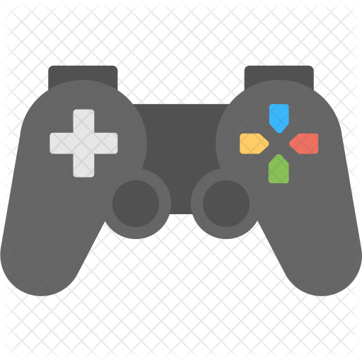

# CS 391-Project

## Project Description
DumDum Games is a webpage that includes two games where you can play with them. One of the games is Tic-Tac-Toe and the other one is Rock-Paper-Scissors. However, Rock-Paper-Scissors is now in the developing process. The purpose of this project is designing a game page for the users and collecting feedback from them about the page. It is a developing web page so that we need feedback. Users can leave a feedback about existing games and they can make new game request. In addition, users can display the creators of this web page and can contact them via LinkedIn and Github.

## Project Members & Responsibilities
---

|Name|Responsibility|
|----|--------------|
|Deniz Yeniçeri| Created Developer Page and Comment Page|
|Umut Oskay| Created Homepage UI including Tic-Tac-Toe game and the Navbar with metaril-ui component|
|Muhammed Ali Kumaşoğlu| Created the form section in Home Page and made Rest service|

## Instructions for running the project
---

1. Download and install Node.js from https://nodejs.org/en/download/ 
2. Download files in the repository
* Go to https://github.com/UmutOskay/Tic-tac-toe-react and download or clone the related files.
3. Find the directory where you downloaded the files and open it in command prompt or terminal.
5. Run  `npm install --force `
6. Run  'json-server --watch db.json'
7. Run  `npm run start `
8.  Say 'y' to usage of port 3001

## Libraries
---

Imported libraries are listed below.
1. @material-ui/core
* In order to design the web page, we used metarial UI's features.
2. @fortawesome/react-fontawesome
3. @fortawesome/free-brands-svg-icons
* In order to use icons, we used https://fontawesome.com/ 
4. react-router-dom
5. axios
* In order to make HTTP request, we used axios library.

## Usage Scenarios
---

When you open the web page by following the steps in the instructions section, Home Page will appear.

* To select a game, press the game's image. For instance, if you want to play Tic-Tac-Toe, you should press below image.

* If you want to leave feedback about the existing games and request a new game, you should use the form in Homepage.

* In the Navbar section, you can display developers' page. Also, you can go to comments page and see other users comment about the project.

* On the Developers page, you can display the developers of this web page. LinkedIn and Github icons which will direct you to developers' accounts are below the their photos.

* There is a game console icon in Navbar. If you want to go back the Home page, you can press this icon. 

* If you wish to see other users' comments, you can click Comments in Navbar.

